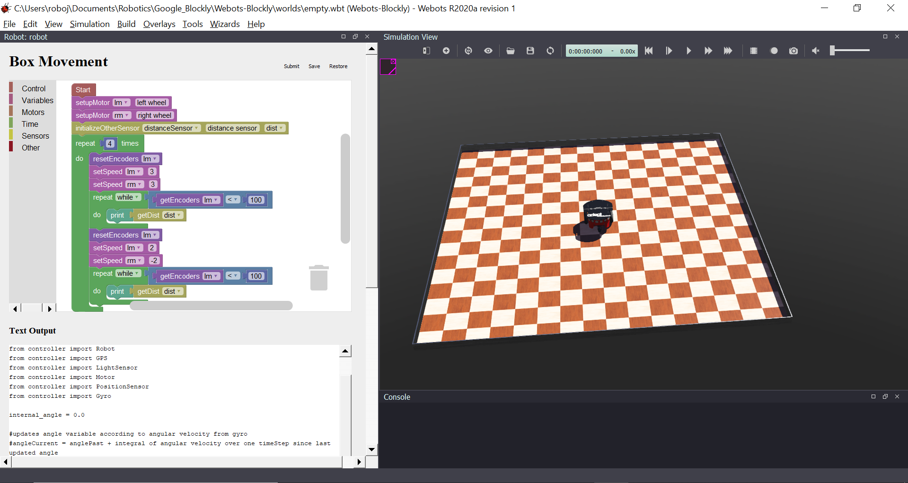

Webots-Blockly is an extension for the Webots simulation platform that allows for drag-and-drop programming. All documentation is in the "documentation" folder.

Important links:

Webots-Blockly [Video Tutorials](https://youtube.com/playlist?list=PLSPNU4D3HphRyhQhvbi4zxSl9uwUDar37):
- [Webots-Blockly Installation](https://youtu.be/bWE3aRRMNLY)
- [Webots-Blockly Programming](https://youtu.be/T_C4VvBAhok)
- [Webots-Blockly Common Errors](https://youtu.be/4ckhuyM3qQ8)

[Webots-Blockly Tutorial Document](https://www.stormingrobots.com/prod/webots/Webots_Blockly_Tutorial.pdf)

[Webots-Blockly Full API Documentation](https://www.stormingrobots.com/prod/webots/Webots_Blockly_API_Documentation.pdf)

[Webots-Blockly Website](https://dev.stormingrobots.com)

[Webots Website](https://cyberbotics.com/)
